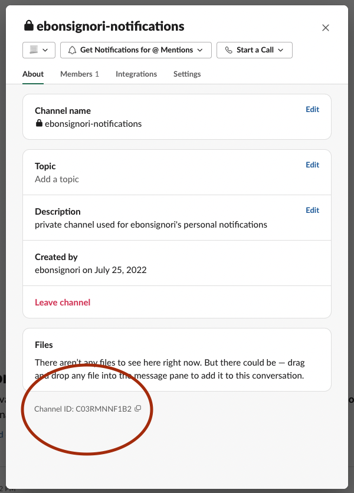

# GitHub Notifications Slack Forwarder

This action is intended to be run from a scheduled GitHub action. It checks all notifications since the last scheduled run and forwards them to a Slack channel or direct message.

Requires access to a Slack Bot with proper `write` permissions to the Slack channel or DM, and a user-generated legacy [personal access token](https://github.com/settings/tokens) with the `notifications` scope enabled.

Forwarded notifications can be filtered by their [reason](#filtering-inputs), [participation](#filter-participating), or [read status](#filter-include-read).

## TOC

* [Example Usage](#example-usage)
* [Finding The Channel ID](#finding-the-channel-id)
* [Inputs](#inputs)
  + [Required Inputs](#required-inputs)
    - [`action-schedule`](#-action-schedule-)
    - [`github-token`](#-github-token-)
    - [`slack-token`](#-slack-token-)
    - [`destination`](#-destination-)
  + [Reason Filtering](#reason-filtering)
    - [`filter-include-reasons`](#-filter-include-reasons-)
    - [`filter-exclude-reasons`](#-filter-exclude-reasons-)
  + [Repository Filtering](#repository-filtering)
    - [`filter-include-repositories`](#-filter-include-repositories-)
    - [`filter-exclude-repositories`](#-filter-exclude-repositories-)
  + [Other Filtering](#other-filtering)
    - [`filter-only-participating`](#-filter-only-participating-)
    - [`filter-only-read`](#-filter-only-read-)
  + [Optional Configuration](#optional-configuration)
    - [`rollup-notifications`](#-rollup-notifications-)
    - [`paginate-all`](#-paginate-all-)
    - [`timezone`](#-timezone-)

## Example Usage

Scheduled action, e.g. `.github/workflows/my-notifications.yml` that runs every 3 hours to forward the past 3 hours of notifications to channel with id "abc1234"

```yml
on:
  schedule:
    - cron: "0 */3 * * *"

jobs:
  forward-notifications:
    runs-on: ubuntu-latest
    steps:
      - name: Forward Notifications
        uses: "Ebonsignori/github-notifications-slack-forwarder"
        with:
          action-schedule: "0 */3 * * *"
          github-token: ${{ secrets.GITHUB_TOKEN }}
          slack-token: ${{ secrets.SLACK_TOKEN }}
          destination: "abc1234"
```

## Finding The Channel ID

In order for a Slack bot to DM you, it needs privledges to.

In order for your bot to post to a channel, you should invite it with `/invite @botname` 

To find the channel's [destination](#destination), you can press on the channel's name or your DMs to find the "Channel ID"




## Inputs

All configuration for the action is set via inputs.

For true/false inputs, a "true" or "false" string is required.

For lists, a comma-separated string is required, e.g. `"apples, bananas, pears"`

### Required Inputs

#### `action-schedule`

The schedule used by the workflow cron that this action is called from.

e.g. Use `"0 */3 * * *"` to check every three hours for the past 3 hours of notifications

You can use [Crontab.guru](https://crontab.guru/) to find a schedule that works for you.

#### `github-token`

A legacy [personal access token](https://github.com/settings/tokens) with the `notifications` scope checked. Store this in your repository's secrets and access it in the action, e.g. `${{ secrets.GITHUB_TOKEN }}`

#### `slack-token`

A token for a Slack App that is invited into the [destination](#destination) and has permissions to post there. Store this in your repository's secrets and access it in the action, e.g. `${{ secrets.SLACK_TOKEN }}`

#### `destination`

The ID of a slack channel or DM that you wish your notifications to go to. See [Finding The Channel ID](#finding-the-channel-id) for how to find the ID of your preferred destination.

### Reason Filtering

For `reason` filters, refer to [notification reason types](https://docs.github.com/en/account-and-profile/managing-subscriptions-and-notifications-on-github/setting-up-notifications/configuring-notifications#filtering-email-notifications) for a more detailed explination of each `reason`.

A list of accepted reasons can be found [here](https://github.com/Ebonsignori/github-notifications-slack-forwarder/blob/main/action.yml#L19)

#### `filter-include-reasons`

Limits the included notifications to the list of `reason`s included in a comma-separated string, e.g. `"assign, author, comment, mention, review_requested"`

Defaults to all `reason`s.

#### `filter-exclude-reasons`

Omits notifications with the listed `reason`s from forwarding to slack using a comma-separated string, e.g. `"security_alert, "push"`

Defaults to all no `reason`s.

### Repository Filtering

Filter which repositories are included/excluded by writing them in a comma-separated string in the form "owner/repo", e.g. `Ebonsignori/github-notifications-slack-forwarder`.


#### `filter-include-repositories`

Limits the forwarded notifications to the list of repositories included in a comma-separated string, e.g. `"github/github, Ebonsignori/my-sites"`

Defaults to empty, `""` which allows all repositories to be included.

#### `filter-exclude-repositories`

Omits forwarding notifications that are in repositories included in the comma-separated string, e.g. `github/howie`

Defaults to empty, `""` which filters out no repositories.

### Other Filtering

#### `filter-only-participating`

Set to `"true"` to only forward notifications in which the user is directly participating or mentioned in.

Defaults to `"false"`

#### `filter-only-read`

Set to `"false"` to also include notifications already marked as "read"

Defaults to `"true"`

### Optional Configuration

#### `rollup-notifications`

By default notifications are sent as a single Slack message.

Set to "false" to send a new Slack messages for each notification (may run into rate limiting problems)

Defaults to "true"

#### `paginate-all`

By default, the action checks the last 100 notifications since the last `action-schedule` was fired. Set to "true" to check all notifications at the cost of a bigger fetch.

Useful if you recieve a lot of notifications and not all are being forwarded to you.

#### `timezone`

Timezone you're located in for displaying dates and times in Slack messages.

**Note** You can set this for display, but the timezone of the action runner should not be changed from its default "UTC"
